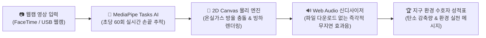
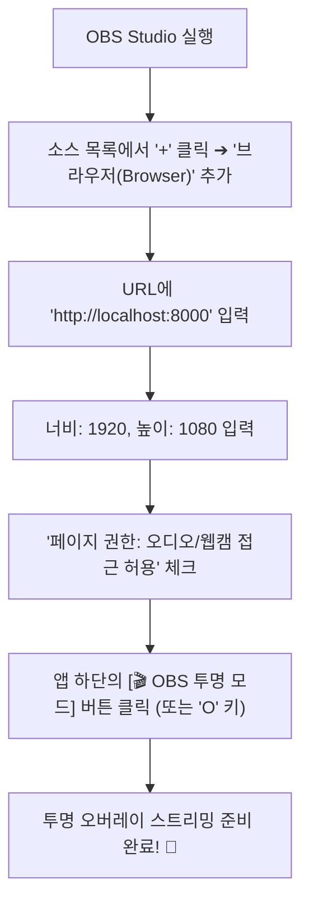

# 🧊 북극 빙하 지킴이 (Arctic Ice Guardian)
> **웹캠 AI 모션 인식 기반의 기후변화 & 탄소 감축 교육 인터랙션 웹 애플리케이션**  
> "교실과 방송 스튜디오에서 손을 뻗어 북극곰의 빙하를 지켜주세요!"

[](LICENSE)
[]()
[]()

---

## 📌 목차
1. [프로젝트 소개 & 교육적 취지](#1-프로젝트-소개--교육적-취지)
2. [주요 핵심 기능](#2-주요-핵심-기능)
3. [초보자를 위한 1초 초간단 실행 방법](#3-초보자를-위한-1초-초간단-실행-방법)
4. [게임 규칙 및 인터랙션 조작법](#4-게임-규칙-및-인터랙션-조작법)
5. [단축키 & 제어 툴바 안내](#5-단축키--제어-툴바-안내)
6. [교실 수업 & 빔프로젝터 대형 스크린 활용 팁](#6-교실-수업--빔프로젝터-대형-스크린-활용-팁)
7. [전문 방송 장비 연동 가이드](#7-전문-방송-장비-연동-가이드)
   - [OBS Studio 투명 오버레이 스트리밍](#7-1-obs-studio-브라우저-소스-투명-오버레이)
   - [Blackmagic ATEM Television Studio HD 크로마키](#7-2-atem-television-studio-hd-크로마키-활용법)
   - [Behringer X32 디지털 믹서 & Mac 오디오 라우팅](#7-3-behringer-x32-오디오-믹서-출력-설정)
8. [폴더 및 코드 아키텍처 (교육자용 해설)](#8-폴더-및-코드-아키텍처-교육자용-해설)
9. [자주 묻는 질문 (FAQ) & 문제 해결](#9-자주-묻는-질문-faq--문제-해결)

---

## 1. 프로젝트 소개 & 교육적 취지

지구 온난화와 기후변화는 오늘날 인류가 마주한 가장 시급한 환경 문제입니다.  
특히 북극의 해빙(Sea Ice)은 전 세계 기후를 조절하는 거대한 반사판 역할을 하지만, 화석연료 연소로 배출되는 이산화탄소(CO₂)와 메탄가스(CH₄)로 인해 유례없는 속도로 녹아내리고 있습니다.

**'북극 빙하 지킴이'**는 교실의 학생들이나 라이브 스트리밍 시청자가 단순히 설명을 듣는 수동적인 교육에서 벗어나,  
**웹캠 앞에서 직접 양손을 움직여 떨어지는 온실가스 풍선을 터뜨리고 북극곰의 터전인 빙하를 보존하는 체감형 모션 인식 인터랙션 교육 게임**입니다.



> [!NOTE]  
> **100% 브라우저 기반 구동:**  
> 별도의 프로그램을 설치하거나 복잡한 환경 설정 없이, 크롬(Chrome)이나 사파리(Safari) 브라우저만 있으면 **M2 Mac, iPad, Windows 11 PC** 어디서나 즉시 실행됩니다.

---

## 2. 주요 핵심 기능

- **Google MediaPipe Tasks Vision 최신 AI 탑재:**
  - 브라우저 WebGL(GPU 가속)을 통해 60fps로 양손(최대 2개 손)의 검지/엄지 손끝 및 관절을 정밀 추적합니다.
- **파일 없는 Web Audio API 신디사이저 사운드:**
  - 외부 오디오 파일(mp3, wav) 다운로드로 인한 로딩 지연이나 누락 없이, 순수 브라우저 음향 합성 기술로 통통 튀는 방울 소리, 영롱한 얼음 차임벨, 묵직한 폭발음을 무지연으로 생성합니다.
- **OBS Studio & ATEM 완벽 지원 (투명 모드 & 크로마키):**
  - 원클릭으로 웹캠 영상을 투명하게 제거하고 오버레이 그래픽만 남기거나, 순수 그린스크린(#00ff00) 배경으로 전환하여 고화질 라이브 스트리밍 및 크로마키 합성이 가능합니다.
- **반응형 고해상도(Retina) 렌더링:**
  - 디스플레이의 `devicePixelRatio`를 자동 인식하여 4K 모니터나 대형 빔프로젝터에서도 글자와 그래픽이 뭉개짐 없이 선명하게 표시됩니다.
- **스마트 거울 모드 (Mirror Mode):**
  - 거울을 보듯 자연스럽게 손을 움직일 수 있도록 화면을 좌우 반전시키며, 글자가 뒤집히지 않도록 텍스트 좌표를 자동으로 역보정합니다.

---

## 3. 초보자를 위한 1초 초간단 실행 방법

웹캠과 최신 브라우저 보안 정책상, 카메라는 `http://localhost` 또는 `https://` 보안 컨텍스트에서만 동작합니다.  
아래 방법 중 본인에게 가장 편한 방법을 1가지 선택하여 클릭 한 번으로 실행하세요.

### 🍎 방법 A: Mac 터미널에서 실행 (M1/M2/M3 MacBook & Mac mini)
Mac에 기본 내장된 파이썬(Python)으로 로컬 서버를 즉시 띄울 수 있습니다.

1. **터미널(Terminal)** 앱을 엽니다.
2. 프로젝트 폴더로 이동합니다:
   ```bash
   cd /Users/shinjoohan/.gemini/antigravity/worktrees/Camera/camera_motion_overlay
   ```
3. 아래 한 줄 명령어를 입력하고 엔터를 칩니다:
   ```bash
   python3 -m http.server 8000
   ```
4. 크롬(Chrome) 또는 사파리(Safari)를 켜고 주소창에 `http://localhost:8000` 을 입력합니다.
5. 브라우저가 "카메라 접근을 허용하시겠습니까?"라고 물어보면 **[허용]**을 클릭합니다!

---

### 💻 방법 B: Windows 11 PC에서 실행
1. 프로젝트 폴더의 빈 공간에서 **Shift 키를 누른 채 마우스 우클릭** ➔ **[PowerShell 열기]** 또는 **[터미널에서 열기]**를 누릅니다.
2. 아래 명령어를 입력합니다:
   ```powershell
   python -m http.server 8000
   ```
3. 브라우저에서 `http://localhost:8000` 으로 접속합니다.

---

### 🎨 방법 C: VSCode 'Live Server' 확장 기능 (마우스 클릭 1번)
1. Visual Studio Code에서 프로젝트 폴더를 엽니다.
2. 마켓플레이스에서 **Live Server** 확장을 설치합니다.
3. 왼쪽 파일 목록에서 `index.html`을 마우스 우클릭한 뒤 **[Open with Live Server]**를 클릭합니다.
4. 자동으로 웹 브라우저가 열리며 게임이 실행됩니다!

---

### 📱 방법 D: iPad (아이패드) Safari에서 접속하기
1. 같은 교실 와이파이에 연결된 Mac이나 PC에서 위 서버를 구동합니다.
2. Mac/PC의 로컬 IP 주소를 확인합니다 (예: `192.168.0.15`).
3. iPad Safari 주소창에 `http://192.168.0.15:8000` 을 입력하여 접속합니다.
4. "카메라 접근 허용"을 누르면 iPad 전면 카메라로 즐길 수 있습니다.

---

## 4. 게임 규칙 및 인터랙션 조작법

카메라 화면 앞에 서서 양손을 들면 손끝 주변에 회전하는 **청량한 얼음빛 수호 링**이 나타납니다.

| 오브젝트 | 명칭 | 손끝 터치 시 효과 | 바닥 빙하 충돌 시 | 스폰 비율 |
| :---: | :---: | :--- | :--- | :---: |
|  `CO₂` | **이산화탄소 방울** | **탄소 감축량 +10kg** 획득 | 빙하 체력 **-5%** 감소 | **45%** |
|  `CH₄` | **메탄가스 방울** | **탄소 감축량 +25kg** 획득 (고득점!) | 빙하 체력 **-7%** 감소 | **25%** |
| ❄️ `ICE` | **눈꽃 수정 결정** | **빙하 체력 +15% 회복!** (영롱한 종소리) | 빙하를 덮으며 부드럽게 소멸 | **18%** |
| ☠️ `BOMB` | **유독 매연 폭탄** | **절대 만지지 마세요!** 체력 **-25% 폭탄 피해** | 바닥에 닿으면 불발되어 소멸 | **12%** |

### 🏆 60초 타임어택 승리 조건
- **제한 시간 60초** 동안 온실가스를 터뜨려 북극곰의 터전인 바닥 빙하 체력을 지켜내세요!
- 빙하 체력이 0%가 되면 북극곰이 살 곳을 잃고 게임이 종료됩니다.
- 60초를 무사히 완주하면 **[지구 환경 수호자 인증서]**와 함께 등급(RANK S ~ B)이 수여됩니다.

### 🖐️ 특별 제스처: 얼음 결계 실드 (Pinch Gesture)
- 엄지손가락과 검지손가락을 맞대는 **'핀치(Pinch)'** 제스처를 취하면 얼음빛 수호 링이 **1.5배 크게 확장**되며 더 넓은 범위의 온실가스를 한 번에 터뜨릴 수 있습니다!

---

## 5. 단축키 & 제어 툴바 안내

교실 수업이나 방송 제어 중 마우스를 쓰지 않고 키보드 단축키로 빠르고 편리하게 조작할 수 있습니다.

| 키보드 단축키 | 화면 UI 버튼 | 기능 설명 |
| :---: | :---: | :--- |
| `Space` | 🚀 **게임 시작** | 3초 카운트다운 후 게임 시작 / 일시 정지 / 계속 하기 |
| `M` | 🪞 **거울 모드** | 내 모습이 거울처럼 자연스럽게 보이도록 좌우 반전 토글 |
| `O` | 🎬 **OBS 투명 모드** | 웹캠 영상을 투명하게 날려 방송 오버레이로 전환 |
| `C` | 🟩 **크로마키 모드** | 배경을 방송용 단색 그린스크린(#00ff00)으로 전환 |
| `S` | 🔊 **사운드 ON/OFF** | 효과음 신디사이저 사운드 음소거 / 음소거 해제 |
| `F` | ⛶ **전체화면** | 교실 빔프로젝터나 모니터 전체화면 진입 / 해제 |
| `Esc` | ✕ **닫기** | 시작 안내 도움말 창 또는 결과 성적표 모달 닫기 |

---

## 6. 교실 수업 & 빔프로젝터 대형 스크린 활용 팁

1. **대형 스크린 전체화면 전환 (`F` 키 또는 ⛶ 버튼)**:
   - 교실 프로젝터나 전자칠판 연결 후 `F` 키를 누르면 브라우저의 주소창과 탭이 숨겨져 온전히 게임 화면에만 몰입할 수 있습니다.
2. **조명 및 카메라 배치**:
   - 학생의 얼굴과 손에 조명이 정면에서 고르게 비추도록 배치하면 MediaPipe의 손동작 인식률이 99% 이상으로 극대화됩니다.
   - 역광(창문을 등지는 위치)은 피해주세요.
3. **거울 모드 기본 켜짐 (`M` 키)**:
   - 학생들이 화면을 볼 때 실제 거울을 보듯 오른손을 들면 화면의 오른쪽 손이 움직여 혼란을 방지합니다.

---

## 7. 전문 방송 장비 연동 가이드

### 7-1. OBS Studio 브라우저 소스 투명 오버레이
OBS Studio에서 웹캠 방송 화면 위에 게임 그래픽(빙하, 온실가스 방울, 손끝 수호 링)을 투명하게 덧씌우는 방법입니다.



> [!TIP]  
> OBS 브라우저 소스 내부에서 웹캠을 직접 사용하거나, 별도의 [비디오 캡처 장치] 소스를 아래 레이어에 두고 본 웹 앱을 상단 투명 오버레이 레이어로 배치하면 전문가 수준의 인터랙션 방송이 완성됩니다.

---

### 7-2. ATEM Television Studio HD 크로마키 활용법
Blackmagic Design의 ATEM Television Studio HD 등 하드웨어 비디오 스위처를 사용할 때:

1. Mac 또는 PC의 HDMI 출력을 **ATEM 스위처의 HDMI 입력단자(예: CAM 1)**에 연결합니다.
2. 본 애플리케이션 하단의 **[🟩 크로마키]** 버튼을 클릭하거나 키보드 `C` 키를 누릅니다.
   - 배경이 완벽한 방송 표준 형광 초록색(`#00ff00`)으로 바뀝니다.
3. ATEM Software Control(소프트웨어 패널)을 엽니다:
   - **Upstream Key 1** ➔ **Chroma** 선택
   - **Fill Source**를 PC가 연결된 입력(CAM 1)으로 지정
   - **Chroma Sample** 버튼을 누르고 화면의 초록색 배경을 클릭하여 샘플링합니다.
4. **ON AIR** 버튼을 누르면 스위처에서 초록색이 실시간으로 싹 빠지며 메인 카메라 영상 위에 북극 빙하와 모션 인터랙션이 방송 송출됩니다!

---

### 7-3. Behringer X32 오디오 믹서 출력 설정
강당이나 방송실의 대형 사운드 시스템(Behringer X32, M32, Wing 등)과 연동할 때:

1. **Mac / PC 오디오 출력 설정**:
   - Mac: [시스템 설정] ➔ [사운드] ➔ [출력]에서 **"X-USB"** 또는 연결된 **오디오 인터페이스 / HDMI 오디오**를 선택합니다.
   - Windows: 작업표시줄 스피커 아이콘 우클릭 ➔ [소리 설정] ➔ 출력 장치를 **"Behringer X32 / X-USB"**로 지정합니다.
2. **Behringer X32 라우팅**:
   - X32 [Routing] 메뉴 ➔ [Inputs] ➔ 해당 스테레오 채널(예: Aux 1-2 또는 Ch 15-16)의 입력을 `Card 1-2`로 지정합니다.
   - 페이더를 올려 통통 튀는 방울 소리와 웅장한 승리 팡파레를 강당 전체에 풍성하게 울려 퍼지게 합니다.

---

## 8. 폴더 및 코드 아키텍처 (교육자용 해설)

본 프로젝트는 최신 ES6 모듈 기반으로 설계되어 기능별로 깔끔하게 모듈화되어 있습니다.  
학생들에게 웹 개발 구조를 가르칠 때 훌륭한 교육 자료로 활용할 수 있습니다.

```
camera_motion_overlay/
├── index.html         # 메인 HTML 구조 (무대 비디오, 캔버스, 글래스모피즘 HUD, 모달)
├── styles.css         # 북극 네온 스타일시트 (OBS 투명 모드, 크로마키, 반응형 레이아웃)
├── js/
│   ├── app.js         # 🌟 [메인 컨트롤러] 4개 모듈을 하나로 묶고 60fps 통합 루프 구동
│   ├── camera.js      # [카메라 모듈] 웹캠 연결, 장치 자동 탐색, 해상도 최적화
│   ├── motion.js      # [AI 비전 모듈] MediaPipe 손동작 인식 및 수호 링 오버레이
│   ├── audio.js       # [사운드 모듈] Web Audio API 기반 무지연 사운드 신디사이저
│   └── game.js        # [게임 모듈] 온실가스 낙하 물리, 충돌 감지, 빙하 체력/점수
└── README.md          # 📖 본 사용자 및 교육자 설명서
```

### 🧠 모듈 간 유기적 데이터 흐름
1. `camera.js`가 웹캠 비디오 스트림을 가져와 `<video id="webcam">`에 재생합니다.
2. `app.js`의 `renderLoop()`가 매 프레임마다 비디오 영상을 `motion.js`의 `detect()`로 전달합니다.
3. `motion.js`의 AI 모델이 양손 관절을 분석하여 손끝 좌표(`fingerPoints`)를 계산합니다.
4. `game.js`의 `updateAndRender()`가 전달받은 손끝 좌표와 하늘에서 떨어지는 온실가스 방울의 거리를 계산하여 충돌을 감지합니다.
5. 방울이 터지면 `audio.js`가 즉시 0.001초 만에 상쾌한 팝 소리를 합성하여 스피커로 출력합니다.
6. 캔버스 위에 녹아내리는 빙하와 반짝이는 손끝 수호 링이 합성되어 화면에 그려집니다.

---

## 9. 자주 묻는 질문 (FAQ) & 문제 해결

### Q1. 브라우저에서 카메라 화면이 검은색으로 나오고 움직이지 않아요.
- **원인:** 다른 프로그램(Zoom, 카카오톡, FaceTime, OBS Studio 등)이 카메라를 독점 사용 중일 수 있습니다.
- **해결책:** 카메라를 사용하는 다른 모든 프로그램을 완전히 종료한 후 웹 브라우저를 새로고침(F5 또는 Cmd+R)해 주세요.

### Q2. 카메라 권한 허용 창이 뜨지 않고 오류 메시지가 나와요.
- **해결책:** 브라우저 주소창 왼쪽의 **자물쇠 또는 카메라 모양 아이콘**을 클릭하여 **"카메라: 항상 허용"**으로 변경한 후 페이지를 새로고침하세요. (반드시 `http://localhost` 또는 `https://` 환경이어야 합니다.)

### Q3. 소리가 나지 않아요!
- **해결책:** 최신 웹 브라우저는 사용자가 화면을 한 번이라도 클릭하기 전까지 소리를 자동으로 내지 않는 '자동재생 방지 정책'이 있습니다. 화면의 **[게임 시작]** 버튼이나 화면 아무 곳이나 한 번 클릭해 주시면 즉시 시원한 효과음이 출력됩니다.

### Q4. 손동작 인식이 조금 끊기거나 느린 것 같아요.
- **해결책:** 
  1. 주변 조명을 밝게 켜서 손과 카메라 사이에 그림자가 생기지 않도록 해주세요.
  2. 크롬 브라우저 설정 ➔ [시스템] ➔ **"가능한 경우 그래픽 가속 사용(하드웨어 가속)"**이 켜져 있는지 확인해 주세요.

---

## 📄 라이선스
본 프로젝트는 **MIT 라이선스**를 따릅니다.  
전 세계의 학교, 비영리 환경 단체, 교육 기관에서 자유롭게 수정 및 배포하여 환경 교육에 활용하실 수 있습니다. 🌍🌱
